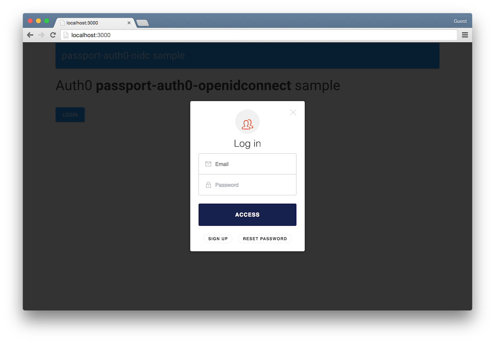
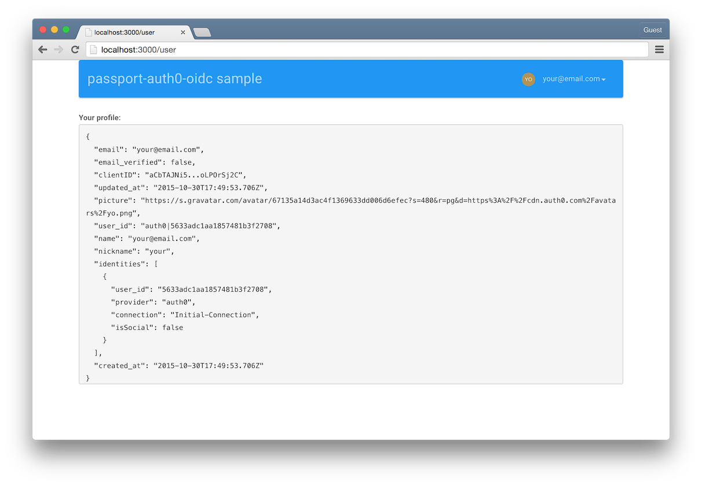

# passport-auth0-oidc sample app

Shows how to use passport-auth0-oidc strategy within a Node.js Regular Web App

## Run locally

1. Add a .env file containing your Auth0 credentials, which can be obtained from the [Auth0 Dashboard](https://manage.auth0.com). Use .env.sample as template.
2. In your App's configuration on the Auth0 Dashboard, add `http://localhost:3000/callback` to the list of **Allowed Callback URLs**. 
3. Run: `npm install` and then `node server`
4. Go to `http://localhost:3000` and you'll see the app running :).

